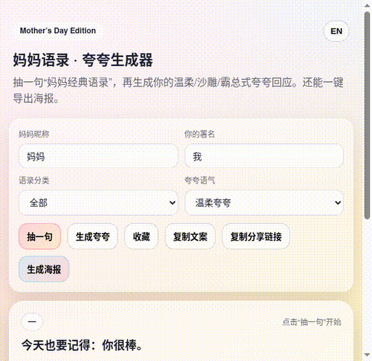

# 妈妈语录 · 夸夸生成器（Mother’s Day Edition）

一个零素材、零依赖的母亲节小网页：随机生成“妈妈经典语录” + 你的“夸夸回应”，并支持一键导出可分享的海报 PNG。  
（支持**中/英一键切换**：界面、语录、夸夸、海报都会随语言切换。）

## 在线体验（Project Link）

- GitHub Pages: https://fupengyu1.github.io/mothers-day-generator/
- Repo: https://github.com/fupengyu1/mothers-day-generator

## Demo（演示）

- 视频（MP4）：[`demo/mothers-day-demo.mp4`](./demo/mothers-day-demo.mp4)
- 动图（GIF）：

## 功能

- 语录抽卡：按分类随机抽取（关心/养生/省钱/催婚/学习工作/生活唠叨）
- 夸夸生成：三种语气（温柔夸夸 / 沙雕搞笑 / 霸总宠妈）
- 收藏 & 历史：本地保存（LocalStorage）
- 复制文案：一键复制整段文案
- 分享链接：把当前卡片状态编码进 URL（朋友打开即可看到同一张卡）
- 海报导出：Canvas 生成 1080×1350 PNG（适合朋友圈/群聊分享）
- 彩蛋：连续抽卡 10 次解锁“最强妈妈奖”奖状

## English

A zero-asset, zero-dependency Mother’s Day web gift: generate classic mom quotes + your sweet replies, export a shareable PNG poster.  
One-click language switch (ZH/EN) for UI, quotes, replies, and posters.

## Submission Post（可直接发帖）

> 也可直接复制 `submission_post.md` 里的内容。

### Post (EN) — Recommended

**Project Link:** https://fupengyu1.github.io/mothers-day-generator/  
**Project Demo (video):** *(upload `demo/mothers-day-demo.mp4` as attachment)*  
**Description:** I built a Mother’s Day mini web gift with TRAE: a “Mom Quotes Generator” that picks classic mom quotes and generates sweet replies in different tones. It supports one-click ZH/EN toggle (UI + quotes + replies + poster), saved/history, shareable links, and one-click poster export (PNG).

### Post（中文）

**项目链接：** https://fupengyu1.github.io/mothers-day-generator/  
**演示（视频）：** *(上传 `demo/mothers-day-demo.mp4` 作为附件)*  
**简介：** 我用 TRAE 做了一个母亲节小游戏网页「妈妈语录·夸夸生成器」：随机抽取妈妈经典语录，并生成不同语气的夸夸回应；支持中英一键切换（界面/语录/夸夸/海报全切换）、收藏/历史、本地保存、可分享链接、以及一键导出 PNG 海报。

## 运行方式（本地）

这是纯静态项目，任意方式打开都行：

### 方式 1：直接双击
直接打开 `index.html` 即可（某些浏览器对剪贴板权限限制较严格，建议用方式 2）。

### 方式 2：起一个本地静态服务器（推荐）

如果你有 Node.js：

```bash
npx serve .
```

或用 Python：

```bash
python3 -m http.server 5173
```

然后浏览器打开提示的地址即可。

## Demo 视频脚本（30–45 秒）

1. 打开页面：选择“养生类”→点【抽一句】
2. 切换“夸夸语气：沙雕搞笑”→点【生成夸夸】
3. 输入“妈妈昵称：女王大人”→卡片自动更新
4. 点【生成海报】→展示预览并下载 PNG
5. 打开右侧【收藏】→展示已收藏的 2–3 条
